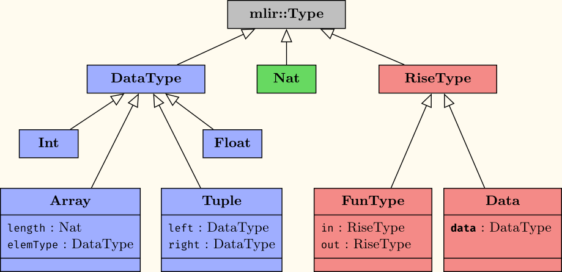

# MLIR

## Rise Dialect
The bigger picture: [paper](https://michel.steuwer.info/publications/2020/AccML/)

A nice looking picture: [poster](https://drive.google.com/file/d/1mFumDjE5GHcsp9AFEDqF6kx4X9mT0LRT/view)


### Design


##### Operations:

Core lambda calculus:
`rise.lambda`
`rise.apply`

Patterns:
`rise.zip`
`rise.map`
`rise.reduce`
`rise.tuple`
`rise.fst`
`rise.snd`

Scalar primitives:
`rise.return`
`rise.add`
`rise.mul`

Interoperability:
`rise.fun`
`rise.in`
##### Typesystem:

- We clearly separate between functions and data, i.e. we can never store functions
  in an array
- **Nat**s are used for demonting the dimentions of **Array**s. They will support computations an the
  indices.
- We will see in the future whether we can integrate more closely with datatypes of other
  dialects (e.g. memrefs)
- Note: Int and Float here are - for now - custom to the Rise dialect and not from Standard 


All our operations return a **RiseType**. `rise.literal` and `rise.apply` return a **Data** and all others return a **FunType**. 
This means an operation will never directly produce a `!rise.float` but always
a `rise.data<float>`: a float wrapped in a **Data**.

Next to the operations we have the following *Attributes*:
`NatAttr`             -> `#rise.nat<natural_number_here>`           e.g. `#rise.nat<1>`

`DataTypeAttr`        -> `#rise.some_datatype_here`                 e.g. `#rise.float or #rise.array<float, 4>`

`LiteralAttr`         -> `#rise.lit<some_datatype_and_its_value>`   e.g  `#rise.lit<float<2>>` (printing form likely to change soon to seperate type from value better!)


##### Syntax:

We follow the mlir syntax.

*Operations* begin with:      `rise.`

*Types* begin with:           `!rise.`    (although we omit `!rise.` when nesting types, e.g. `!rise.array<float, 4>` instead of `!rise.array<rise.float, 4>`)

*Attributes* begin with:      `#rise.`

See the following examples of types:

- `!rise.float` -                           Float type

- `!rise.array<4, float>` -                 ArrayType of size `4` with elementType `float`

- `!rise.array<2, array<2, int>` -         ArrayType of size `2` with elementType Arraytype of size `2` with elementType `int`


- `!rise.data<float>>` -                    Data containing the DataType `float` (might for example be the result of a Lambda)
  
- `!rise.data<array<4, float>>` -           Data containint an ArrayType of size `4` with elementType `float`

Note FunTypes always have a RiseType (either Data or FunType) both as input and output!

- `!rise.fun<data<float> -> data<int>>` -   FunType from data<float> to data<int>
  
- `!rise.fun<fun<data<int> -> data<int>> -> data<int>>` -   FunType with input FunType from (`data<int>` to `data<int>`) to `data<int>` 

See the following examples of attributes:

- `#rise.lit<float<4>>` -                   LiteralAttribute containing a `float` of value `4`

- `#rise.lit<array<4, float, [1,2,3,4]>` - LiteralAttribute containing an Array of `4` floats with values, 1,2,3 and 4 

##### Modeling of Lambda Calculus:

Consider the following example: `map(fun(summand => summand + summand), [5, 5, 5, 5])` that will compute `[10, 10, 10, 10]`.

We have the `map` function that is called with two arguments: a lambda expression that doubles it's input and an array literal.
We model each of these components individually:
 - the function call via a `rise.apply` operation;
 - the `map` function via the `rise.map` operation;
 - the lambda expression via the `rise.lambda` operation; and finally
 - the array literal via the `rise.literal` operation.
 
Overall the example in the Rise MLIR dialect looks like
```
%array = rise.literal #rise.lit<array<4, !rise.float, [5,5,5,5]>>
%doubleFun = rise.lambda (%summand) : !rise.fun<data<float> -> data<float>> {
  %addFun = rise.add #rise.float
  %doubled = rise.apply %addFun, %summand, %summand
  rise.return %doubled : !rise.data<float>
}
%map4IntsToInts = rise.map #rise.nat<4> #rise.float #rise.float
%mapDoubleFun = rise.apply %map4IntsToInts, %doubleFun %array
```

Let us highlight some key principles regarding the `map` operation that are true for all Rise patterns (`zip`, `fst`, ...):
- `rise.map` is a function that is called using `rise.apply`.
- For `rise.map` a couple of attributes are specified, here: `rise.map #rise.nat<4> #rise.float #rise.float`.
  These are required to specify the type of the `map` function at this specific call site.
  You can think about the `rise.map` operation as being *polymorphic* and that the attributes specify the type parameters to make the resulting MLIR value `%map4IntsToInts` *monomorphic* (i.e. it has a concrete type free of type parameters).

### Lowering to imperative

Lowering rise code (everything within rise.fun) to imperative is accomplished
with the `riseToImperative` pass of `mlir-opt`.

This brings us from the functional lambda calculus representation of rise to an imperative
representation, which for us right now means a mixture of the std, loop and
linalg dialects.

Leveraging the existing passes in MLIR, we can emit the llvm IR dialect by
executing the passes: `mlir-opt -convert-rise-to-imperative -convert-linalg-to-loops -convert-loop-to-std -convert-std-to-llvm`


##### Intermediate Stage
The operations shown above model lambda calculus together with common data parallel patterns and some operations for interoperability with other dialetcs.
Besides we also have the following internal `codegen` operations, which drive the imperative code generation. These are intermediate operations in the sense that they are created and consumed in the riseToImperative pass. They should not be used manually. They will not be emmitted in the lowered code.

- `rise.codegen.assign`
- `rise.codegen.idx`
- `rise.codegen.bin_op`
- `rise.codegen.zip`
- `rise.codegen.fst`
- `rise.codegen.snd`

These Intermediate operations are constructed during the first lowering phase
`(rise -> intermediate)` and are mostly used to model indexing for reading and
writing multidimensional data. They have similarities with views on the data. For details on the translation of these codegen
operations to the final indexings refer to Figure 6 of [this paper[1]](https://michel.steuwer.info/files/publications/2017/arXiv-2017.pdf).


##### Here are further descriptions of lowering specific examples:
- [current state of lowering to imperative](lowering/state_of_lowering_23_03.md)
- [current(outdated) state of lowering to imperative](lowering/state_of_lowering.md)
- [lowering strategy and concepts](lowering/lowering_strategy_and_concepts.md)
- [lowering a simple reduction](lowering/simple_reduction_lowering.md)
- [lowering a simple 2D map](lowering/simple_2D_map_lowering.md)
- [lowering a simple map](lowering/simple_map_lowering.md)
- [lowering a simple zip](lowering/simple_zip_lowering.md)

outdated but kept around for later reference:
- [outdated - lowering a simple reduction - example](lowering/old_reduce_lowering_to_imperative.md)
- [outdated - lowering a reduction - IR transformation](lowering/old_reduction_lowering_IR_transformations.md)
- [concept for lowering a dot_product](lowering/concept_for_lowering_dot_product.md)
- [matrix-multiplication example](lowering/matrix_multiplication_example_uday.md)
